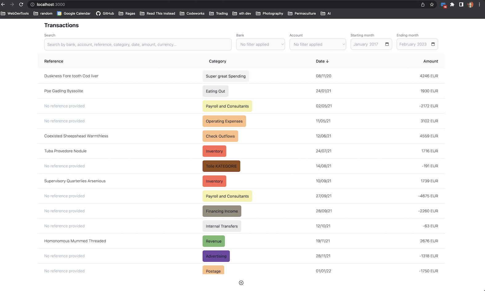
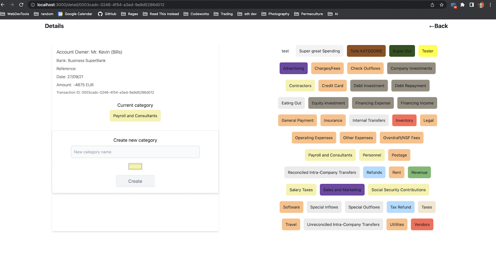

# Frontend Coding Challenge
Nuxt3, Vue3, Pinia, Apollo, TailwindCSS

## Setup

Make sure to install the dependencies:

```bash

yarn install

```

Make sure the url in the `nuxt.config` is setup correctly to reach the backend.


## Development Server

Start the development server on http://localhost:3000

```bash
yarn run dev
```

## If I had more time I would..
1. Persist search/filter when navigating back from detail page
2. Rewrite search to take all edge cases into account
3. Optimize filter/search when used together
4. Refactor all pages and components into TypeScript
5. Write Unit, integration and end-to-end tests
6. Rewrite the pagination to use the "after" query, only fetching new results not all of them again
7. Refactor remaining functions that interact with API from index into Pinia store
8. Create more smaller components, like table cells, buttons, etc.
9. Make it look better ;)

<p align="center">

</p>

-----------------------------------------------------------------------------------

<p align="center">

</p>